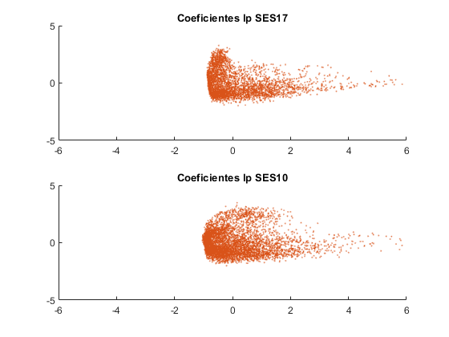
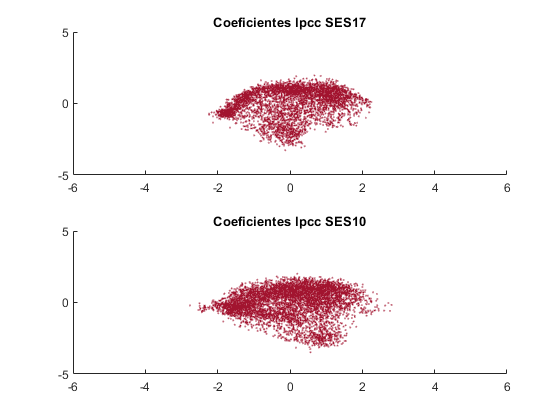
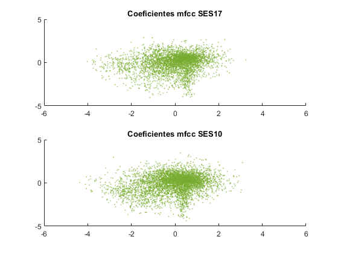
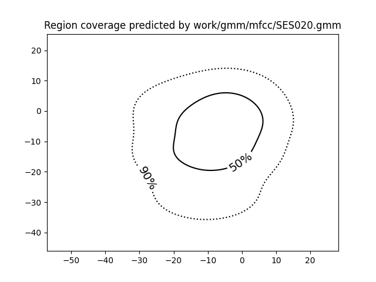
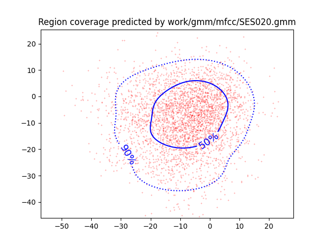
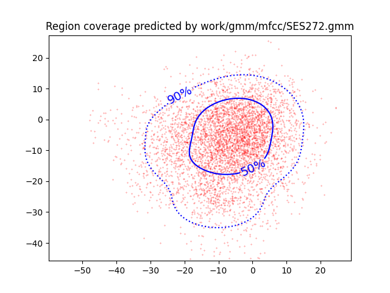

PAV - P4: reconocimiento y verificación del locutor
===================================================

Obtenga su copia del repositorio de la práctica accediendo a [Práctica 4](https://github.com/albino-pav/P4)
y pulsando sobre el botón `Fork` situado en la esquina superior derecha. A continuación, siga las
instrucciones de la [Práctica 2](https://github.com/albino-pav/P2) para crear una rama con el apellido de
los integrantes del grupo de prácticas, dar de alta al resto de integrantes como colaboradores del proyecto
y crear la copias locales del repositorio.

También debe descomprimir, en el directorio `PAV/P4`, el fichero [db_8mu.tgz](https://atenea.upc.edu/pluginfile.php/3145524/mod_assign/introattachment/0/spk_8mu.tgz?forcedownload=1)
con la base de datos oral que se utilizará en la parte experimental de la práctica.

Como entrega deberá realizar un *pull request* con el contenido de su copia del repositorio. Recuerde
que los ficheros entregados deberán estar en condiciones de ser ejecutados con sólo ejecutar:

~~~~~~~~~~~~~~~~~~~~~~~~~~~~~~~~~~~~~~~~~~~~~~~~~~~~~.sh
  make release
  run_spkid mfcc train test classerr verify verifyerr
~~~~~~~~~~~~~~~~~~~~~~~~~~~~~~~~~~~~~~~~~~~~~~~~~~~~~

Recuerde que, además de los trabajos indicados en esta parte básica, también deberá realizar un proyecto
de ampliación, del cual deberá subir una memoria explicativa a Atenea y los ficheros correspondientes al
repositorio de la práctica.

A modo de memoria de la parte básica, complete, en este mismo documento y usando el formato *markdown*, los
ejercicios indicados.

## Ejercicios.

### SPTK, Sox y los scripts de extracción de características.

- Analice el script `wav2lp.sh` y explique la misión de los distintos comandos, y sus opciones, involucrados
  en el *pipeline* principal (`sox`, `$X2X`, `$FRAME`, `$WINDOW` y `$LPC`).

Para empezar explicaremos que hace cada comando:

sox: sirve para generar una señal del formato adecuado a partir de una señal con otro formato (por ejemplo, WAVE). Indicando como fichero de salida un guion (-) hacemos que sox escriba la salida en la salida estándar. Así, la orden siguiente tiene el mismo resultado que la indicada en al apartado anterior, pero sin la necesidad de generar un fichero en formato crudo.

x2x: es el programa de SPTK que permite la conversión entre distintos formatos de datos.

frame: divide la señal de entrada en tramas de 'x' muestras (1/x ms) con desplazamiento de ventana de 'y' muestras (1/y ms).

window: multiplica cada trama por la ventana de Blackman (opción por defecto).

lpc: Calcula los lpc_order primeros coeficientes de predicción lineal, precedidos por el factor de ganancia del predictor.

En el caso concreto de la práctica tenemos:

<code># Main command for feature extration
sox $inputfile -t raw -e signed -b 16 - | $X2X +sf | $FRAME -l 240 -p 80 | $WINDOW -l 240 -L 240 | $LPC -l 240 -m $lpc_order > $base.lp</code>

- Explique el procedimiento seguido para obtener un fichero de formato *fmatrix* a partir de los ficheros
  de salida de SPTK (líneas 41 a 47 del script `wav2lp.sh`).

Lo que se encarga de hacer en la línea de código anterior es:

  sox: El tramo pasa al formato que queremos a partir de un fichero raw y (-e) codifica con el formato signed, además (-b) codifica en 16 bits la muestra que se toma. 

  x2x: En el siguiente tramo (+sf) especifica que el formato de entrada es short y el de salida es float. 

  frame: El siguiente tramo divide la señal de entrada en tramas de 240 muestras (4,17 ms) con desplazamiento de ventana de 80 muestras (12,5 ms). 

  window: El siguiente tramo multiplica por una ventana de Blackman, donde el input tendrá una longitud de 240 muestras y el output también.

  
  lpc: El último tramo calcula los primeros coeficientes del LPC (dados con $lpc_order), en concreto (-l) especifica  que el factor de ganancia será de 240 y (-m) especifica los coeficientes anteriores.

  El resultado se inyecta en $base.lp

Una vez lo tenemos procedemos a las siguientes línesa que muestran lo siguiente:

<code>
# Our array files need a header with the number of cols and rows:
ncol=$((lpc_order+1)) # lpc p =>  (gain a1 a2 ... ap) 
nrow=`$X2X +fa < $base.lpcc | wc -l | perl -ne 'print $_/'$ncol', "\n";'`</code>

  En esta líne se construye la matriz donde se almacenan los datos. Cada fila corresponde a una trama de señal, y cada columna a cada uno de los coeficientes con los se parametriza la trama. Cuando se escribe en el fichero, primero se escriben el número de filas y columnas, y luego se escriben los datos.

  * ¿Por qué es conveniente usar este formato (u otro parecido)?

??????????????????????????????????????

- Escriba el *pipeline* principal usado para calcular los coeficientes cepstrales de predicción lineal
  (LPCC) en su fichero <code>scripts/wav2lpcc.sh</code>:

<code>
sox $inputfile -t raw -e signed -b 16 -| $X2X +sf | $FRAME -l 240 -p 80 | $WINDOW -l 240 -L 240 |
	$LPC -l 240 -m $lpc_order | $LPCC -m $lpc_order -M $cepstrum_order > $base.lpcc
</code>

- Escriba el *pipeline* principal usado para calcular los coeficientes cepstrales en escala Mel (MFCC) en
  su fichero <code>scripts/wav2mfcc.sh</code>:

<code>
sox $inputfile -t raw -e signed -b 16 -| $X2X +sf | $FRAME -l 240 -p 80 | $WINDOW -l 240 -L 240 |
	$MFC -l 240 -m $mfcc_order -s 16 -n 40 > $base.mfcc
</code>

### Extracción de características.

- Inserte una imagen mostrando la dependencia entre los coeficientes 2 y 3 de las tres parametrizaciones
  para una señal de prueba.

  
  
  

  + ¿Cuál de ellas le parece que contiene más información?

La muestra que tiene más información será aquella que tenga las muestras más incorreladas. En este caso vemos que en los coeficientes del lp y lpcc las muestras tienden a agruparse en zonas concretas, sin embargo en el mfcc la muestras estan más dispersada y no hay una zona de agrupación tan clara como en los anteriores métodos. Por esto creemos que el mfcc contiene las muestras con más información.

- Usando el programa <code>pearson</code>, obtenga los coeficientes de correlación normalizada entre los
  parámetros 2 y 3, y rellene la tabla siguiente con los valores obtenidos.

Ejecutando los comandos:
<code>pearson work/lp/BLOCK01/SES017/*.lp</code>
<code>pearson work/lpcc/BLOCK01/SES017/*.lpcc</code>
<code>pearson work/mfcc/BLOCK01/SES017/*.mfcc</code>

  |                        | LP       | LPCC        | MFCC 
  |------------------------|:----:    |:----:       |:----:
  | &rho;x[2,3] |-0.872284 | 0.177135    | 0.073151     
  
  + Compare los resultados de <code>pearson</code> con los obtenidos gráficamente.
  
Los coeficientes obtenidos mediante Pearson tienen su intervalo en [-1,1], y cuanto más cercano a los extremos es este valor obtenido, mayor es su correlación. Del mismo modo cuanto más cercano al 0 es el valor del coeficiente, más incorrelado es. En este sentido vemos que el MFCC es el más cercano al 0, lo cual concuerda con lo visto en el apartado de las gráficas, donde los puntos estaban más dispersos.

- Según la teoría, ¿qué parámetros considera adecuados para el cálculo de los coeficientes LPCC y MFCC?

De la teoria sabemos que para el habla un número de filtros habitual usado en MFCC es M=40, y en lo que respecta el número de coeficientes este número seria de Q=13.

### Entrenamiento y visualización de los GMM.

Complete el código necesario para entrenar modelos GMM.

- Inserte una gráfica que muestre la función de densidad de probabilidad modelada por el GMM de un locutor
  para sus dos primeros coeficientes de MFCC.

Con el comando siguiente obtenemos:

<code>
plot_gmm_feat work/gmm/mfcc/SES020.gmm work/mfcc/BLOCK02/SES020/*.mfcc -f white -g black &
</code>

  

- Inserte una gráfica que permita comparar los modelos y poblaciones de dos locutores distintos (la gŕafica
  de la página 20 del enunciado puede servirle de referencia del resultado deseado). Analice la capacidad
  del modelado GMM para diferenciar las señales de uno y otro.

Con los comandos siguientes obtenemos:

<code>plot_gmm_feat work/gmm/mfcc/SES020.gmm work/mfcc/BLOCK02/SES020/*.mfcc -f red -g blue & </code>
<code>plot_gmm_feat work/gmm/mfcc/SES272.gmm work/mfcc/BLOCK27/SES272/*.mfcc -f red -g blue &</code>

  
  

Las imagenes que vemos nos muestran dos locutores distintos, donde a cada uno se le han modelado unos coeficientes distintos, dados por una GMM específica del locutor. En este sentido vemos que ambas tienen una forma parecida, pero estan bastante definidas a cada locutor, con lo cual cuando tengamos que asignar una nueva muestra a algún locutor y se deba calcular la distáncia a cada GMM, probablemente se asigne correctamente al locutor del que proviene, no obstante es importante destacar que siempre existe un margen de error.

### Reconocimiento del locutor.

Complete el código necesario para realizar reconociminto del locutor y optimice sus parámetros.

- Inserte una tabla con la tasa de error obtenida en el reconocimiento de los locutores de la base de datos
  SPEECON usando su mejor sistema de reconocimiento para los parámetros LP, LPCC y MFCC.

|                        | LP       | LPCC        | MFCC 
|------------------------|:----:    |:----:       |:----:
|Ratio de pérdidas       | |  |     

### Verificación del locutor.

Complete el código necesario para realizar verificación del locutor y optimice sus parámetros.

- Inserte una tabla con el *score* obtenido con su mejor sistema de verificación del locutor en la tarea
  de verificación de SPEECON. La tabla debe incluir el umbral óptimo, el número de falsas alarmas y de
  pérdidas, y el score obtenido usando la parametrización que mejor resultado le hubiera dado en la tarea
  de reconocimiento.

|                        | LP       | LPCC        | MFCC 
|------------------------|:----:    |:----:       |:----:
|Coste de detección      | |  |     
|------------------------|:----:    |:----:       |:----:
|Falsa alarma            | |  |    
|------------------------|:----:    |:----:       |:----:
|Número de pérdidas      | |  |    
|------------------------|:----:    |:----:       |:----:
|Umbral usado (TH)       | |  |  

 
### Test final y trabajo de ampliación.

- Recuerde adjuntar los ficheros `class_test.log` y `verif_test.log` correspondientes a la evaluación
  *ciega* final.

- Recuerde, también, enviar a Atenea un fichero en formato zip o tgz con la memoria con el trabajo
  realizado como ampliación, así como los ficheros `class_ampl.log` y/o `verif_ampl.log`, obtenidos como
  resultado del mismo.
